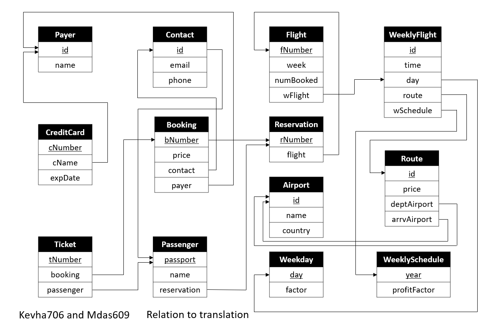

# SQL-Airport

### **This is part of Database System course**

## Creating a program using SQL to manage entire system of the following.

## The ER Diagram of the following Relational is the following.

## The initial functions are as follows

-	addYear()
-	addDay()
-	addDestination()
-	addRoute()
-	addFlight()

## The helper functions are as follows

-	calculateFreeSeats()
-	calculatePrice()

## The trigger is as follows

-	ticketGenerator()

## The advanced functions are as follows

-	addReservation()
-	addPasseger()
-	addContact()
-	addPaymant()

## The view is as follows

-	allFlights